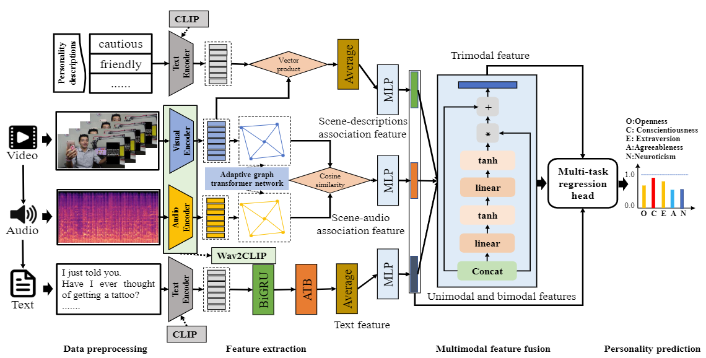

### A multimodal personality prediction framework based on adaptive graph transformer network and multi-task learning



You can install the necessary toolkits by:

```shell
pip install -r requirements.txt
```


Before running the code, please download the extracted data and our trained model checkpoints from [this link](https://drive.google.com/drive/folders/1uHweaOKppG9-2LyOIxppfC-M9hQCw49Y?usp=sharing) and unzip it to the root directory.


You can train the model by:

```shell
python train.py -d CFIv2
# or
python train.py -d UDIVA
```

Similarly, you can also view the results of our trained model

```python
python test.py -d CFIv2
# or
python test.py -d UDIVA
```

